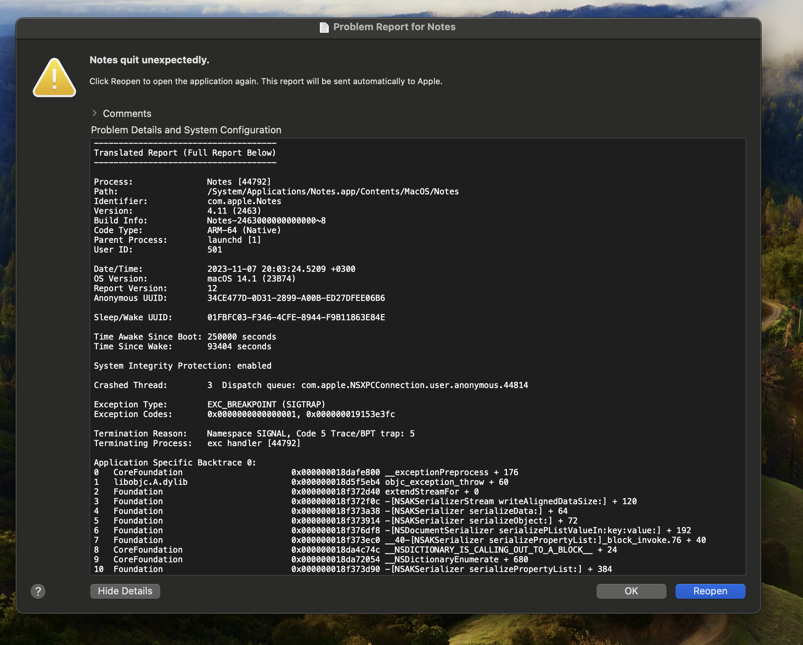

# Fresh Notes App

## Table of contents
- [Fresh Notes App](#fresh-notes-app)
  - [Table of contents](#table-of-contents)
  - [About](#about)
    - [Story](#story)
  - [Setup](#setup)

## About
A cross-platform, open-source notes app written in Flutter, Kotlin, Swift, Typescript and Firebase

### Story
We are all interested in building mobile apps for iOS and Android, so we had to use macOS to write and build native iOS applications using Xcode, when using any operating system I usually take a lot of notes and I needed an notes app and I prefer it to not be a third party so I used Notes app on macOS but after updating to macOS 14.1 the notes app never working and it doesn't matter what I do I always getting crashes

Tap to show/hide screenshot

 

it's known to be limited on AppleOS and it's closed so there is not much I can do, so I create this little app and usually I prefer my repositories to public so I decided to also publish it even though that wasn't my plan

## Setup
1. Setup Flutter, Android Studio, Xcode on your local machine
2. Install the [Firebase CLI](https://firebase.google.com/docs/cli)
3. Configure Firebase with your Flutter app using the offical [documentation](https://firebase.google.com/docs/flutter/setup), you are welcome to setup it manually, I prefer to do it manually but to make it faster to setup the app for new anyone I will use the automated CLI
4. Create Firebase Firestore index

    Composite indexes:  
    userId: Ascending   
    updatedAt: Descending  
    __name__ Descending  

    Instead of defining a composite index manually, try to run all the queries in the app by testing everything to get a links for generating the required index. and you will get a url to open Like:
    [https://console.firebase.google.com/v1/r/project/mynotes-eb717/firestore/indexes?....](https://console.firebase.google.com/v1/r/project/mynotes-eb717/firestore/indexes?create_composite=Cktwcm9qZWN0cy9teW5vdGVzLWViNzE3L2RhdGFiYXNlcy8oZGVmYXVsdCkvY29sbGVjdGlvbkdyb3Vwcy9ub3Rlcy9pbmRleGVzL18QARoKCgZ1c2VySWQQARoNCgl1cGRhdGVkQXQQAhoMCghfX25hbWVfXxAC)

1. Configure App check in firebase for Android and iOS (optional)
2. Setup App Links for Android and Universal Links for iOS (optional)

<!-- 1. Firebase: First setup firebase for both android/ios, register the apps and download the configurations and put
them in the desire place, "google-services.json" for android, ios "GoogleService-Info.plist"
already ignored in the .gitignore

1. Permissions

    Android:
        `
         <uses-feature
        android:name="android.hardware.camera"
        android:required="false" />

    <uses-permission android:name="android.permission.INTERNET" />
    <uses-permission android:name="android.permission.ACCESS_NETWORK_STATE" />
    <uses-permission android:name="android.permission.CAMERA" />
    <uses-permission
        android:name="android.permission.WRITE_EXTERNAL_STORAGE"
        android:maxSdkVersion="29" />
        `

    Ios:
    "<key>NSCameraUsageDescription</key>
	<string>We need access to the photo library so you take a photo</string>
	<key>NSPhotoLibraryUsageDescription</key>
	<string>We need access to the photo library so you pick image</string>
	<key>NSPhotoLibraryAddUsageDescription</key>
	<string>To save images into the library, we need permission from you</string>
	<key>FirebaseAutomaticScreenReportingEnabled</key>
	<false/>"

2. Localizations in Android and iOS
    iOS in info.plist:
    `
	<key>CFBundleLocalizations</key>
	<array>
		<string>en</string>
		<string>ar</string>
	</array>
    `
    Android:
    Create a file called res/xml/locales_config.xml and specify your app's languages, including your app's ultimate fallback locale, which is the locale specified in res/values/strings.xml.
    `
    <?xml version="1.0" encoding="utf-8"?>
    <locale-config xmlns:android="http://schemas.android.com/apk/res/android">
        <locale android:name="en"/>
        <locale android:name="ar"/>
    </locale-config>
    `
    In the manifest, add a line pointing to this new file:
    <manifest>
        ...
        <application
            ...
            android:localeConfig="@xml/locales_config">
        </application>
    </manifest>
    Specify supported languages in Gradle
    If not already present, specify the same languages using the resourceConfigurations property in your app's module-level build.gradle file:

    `
    android {
        ...
        defaultConfig {
            resourceConfigurations += ["en", "ar"]
        }
    }
    `

4. Create firebase firestore index

Composite indexes:
userId: Ascending
updatedAt: Descending
__name__ Descending

Instead of defining a composite index manually, try to run all the queries in the app by testing everything to get a links for generating the required index. and you will get a url to open 
[Like: https://console.firebase.google.com/v1/r/project/mynotes-eb717/firestore/indexes?create_composite=Cktwcm9qZWN0cy9teW5vdGVzLWViNzE3L2RhdGFiYXNlcy8oZGVmYXVsdCkvY29sbGVjdGlvbkdyb3Vwcy9ub3Rlcy9pbmRleGVzL18QARoKCgZ1c2VySWQQARoNCgl1cGRhdGVkQXQQAhoMCghfX25hbWVfXxAC](https://console.firebase.google.com/v1/r/project/mynotes-eb717/firestore/indexes?create_composite=Cktwcm9qZWN0cy9teW5vdGVzLWViNzE3L2RhdGFiYXNlcy8oZGVmYXVsdCkvY29sbGVjdGlvbkdyb3Vwcy9ub3Rlcy9pbmRleGVzL18QARoKCgZ1c2VySWQQARoNCgl1cGRhdGVkQXQQAhoMCghfX25hbWVfXxAC)

5. Configure App check in firebase for Android and iOS

6. configure iOS app notification permissions and etc...

7. Don't forgot to change app name, app icons, notifications icons, branding and applicationId and everything that is releated to this app when republish it again -->